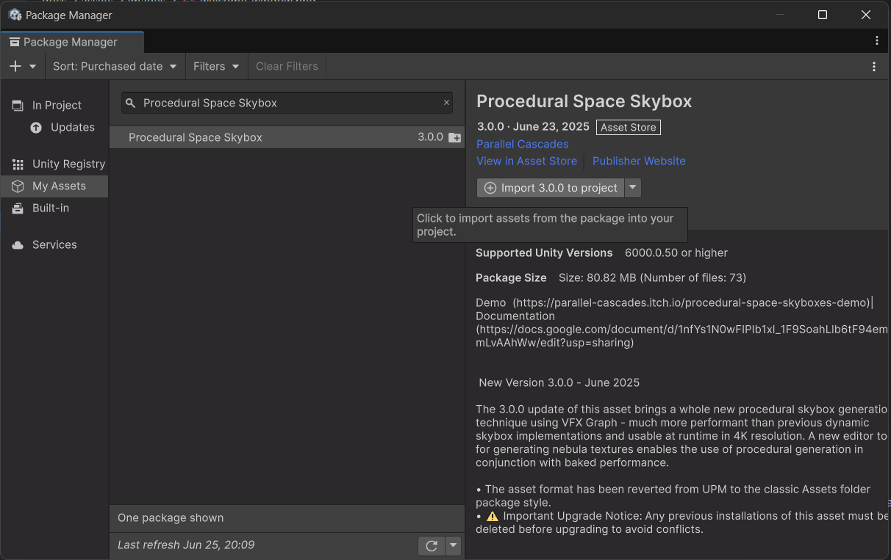
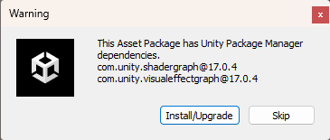

# Installation

## Importing the Asset
To install this asset, import it in your project using the Package Manager:

<figure markdown="span">
    
    <figcaption>This window is found under <code>Window/Package Manager</code></figcaption>
</figure>

### Requirements
Both skybox techniques used in this asset require Unity's Shader Graph package. It comes pre-installed in projects using the Universal Render Pipeline (URP).

The VFX Graph Skybox technique is built with Unity's Visual Effect Graph package. 

When importing the asset from the Package Manager, you will get a pop-up window asking you to install both:

