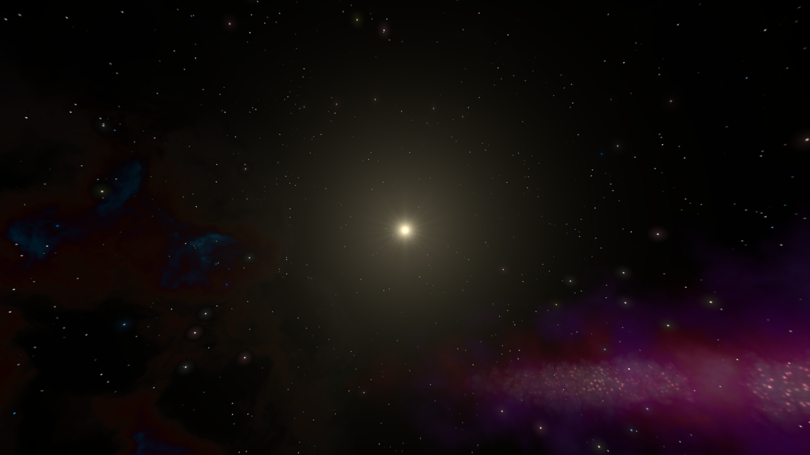

# Procedural Space Skybox

This asset includes tools and effects for creating procedural space skyboxes for your Unity games. Included are shader effects and materials, editor tools and VFX Graph systems and particles for creating different styles of space skyboxes.

## Why use a procedural skybox?

- Procedural skyboxes offer extensive customization options, letting you generate unique looking levels for your games and prototypes in seconds.
- Using a dynamic skybox reduces game size on the disk, since you're not using any disk space for large pre-rendered skybox textures.
- Or, if performance is a larger priority than file size, editor tools are included to render dynamic skyboxes to cubemap textures, to boost GPU performance at the cost of storage space.
- Integration with random-level generation systems (coming soon).

## Get Started
Get started by [Installing](getting-started/installation.md) the package and looking at the sample scenes in your project, or try out the [Windows Demo](https://parallel-cascades.itch.io/procedural-space-skyboxes-demo).