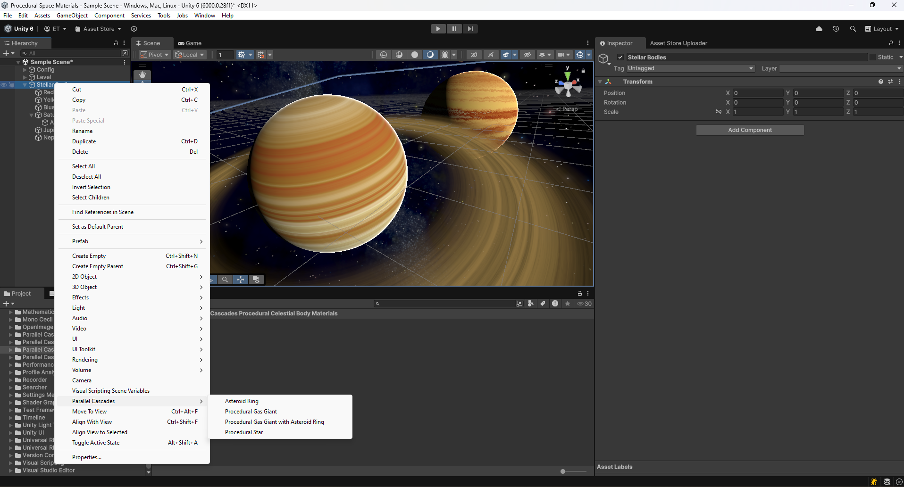
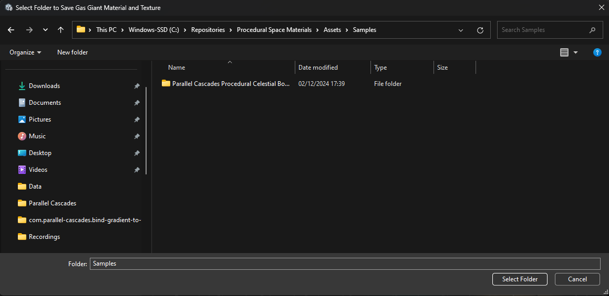

# Custom Menu Commands

Each procedural celestial body in your scene requires its own material and gradient texture. If you use the post-fx glow effect, that too requires its own material.

You should use the custom menu commands added to Unity’s context menu to automatically have all the texture and material generation and adding of components, assigning of references, handled automatically.

    
    <figcaption style="font-size: 0.95em; margin-top: 0.5em;">
        To find the commands, right-click in your hierarchy view, or use the <code>GameObject &gt; Parallel Cascades &gt; *</code> menu.
    </figcaption>

Once you click on an option, a save folder window will open:

This is the folder where your body’s material and textures will be saved. It is recommended to create a new one for each new celestial body, to keep your project tidy.