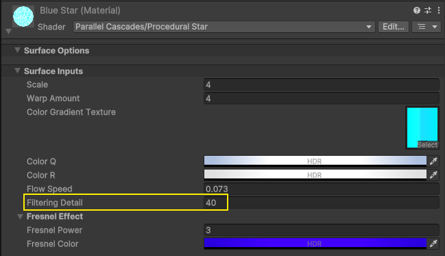

# Filtering Detail Levels (Advanced Option)

Viewing stars and gas giants from a distance can cause aliasing, where high-detail (large-scale) patterns appear as flickering dots on the surface. This will be most visible when moving the camera in relation to the planets.

To avoid this problem, a supersampling algorithm is integrated into the shader, based on a [filtering technique](https://iquilezles.org/articles/filtering/) proposed by Inigo Quilez.

You don’t need to understand this technique to use the filtering, you simply need to increase the value of the Filtering Detail property in the material. The higher the value, the more smoothed the material will be when viewed at a distance, but this comes with a performance cost, so it should not be overused, nor used when the material takes up a large portion of the screen.

