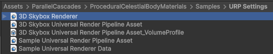
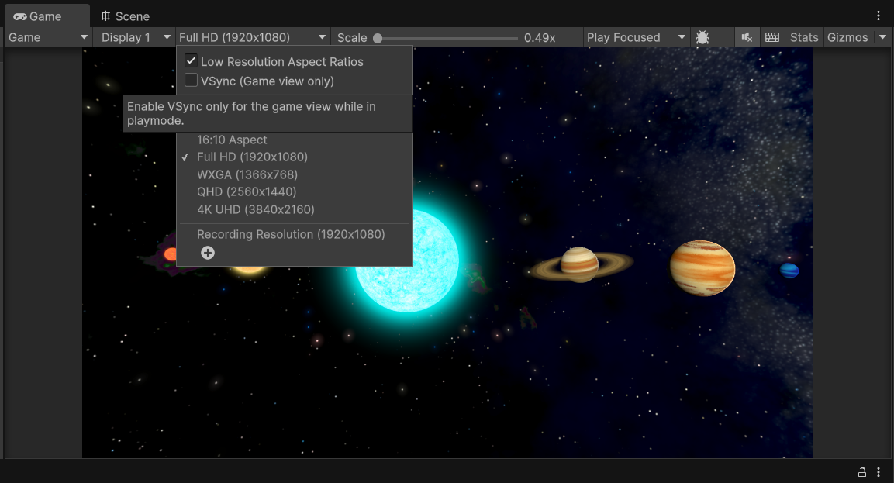
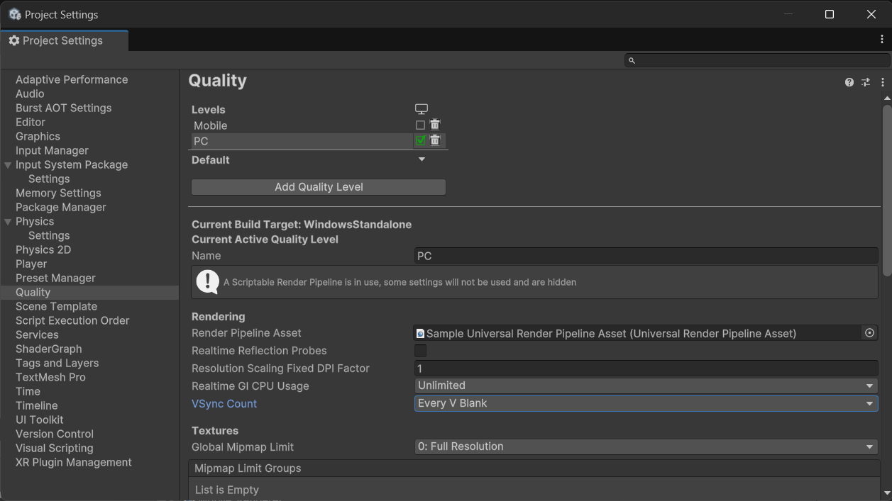

# Procedural Celestial Body Materials Introduction

This asset contains a set of procedural materials and scripts you can use to generate gas giants, asteroid rings and stars, and stylize them with post-processing glow effects.

## Asset Contents

1. Shader Graph Procedural Shaders and Materials, MonoBehaviour scripts for quick setup of:

    - [Procedural Asteroid Ring]()
    - [Procedural Gas Giant + Lit Atmospheric Glow Effect](./procedural-gas-giants.md)
    - [Procedural Star + Star Corona Glow](./procedural-stars.md)

2. Utility Editor Scripts

    - [Editor Menu Items](./custom-menu-commands.md) to create procedural celestial bodies with all materials, textures, and components assigned and ready to edit.

3. Custom 3D Meshes for celestial bodies

    - icosphere_high - high-poly sphere for rendering smooth stars and gas giants. High triangle and vertex count allow for smoother looking dynamic procedural visuals.
    - double_sided_plane - double-sided plane mesh allow for Asteroid Rings to be viewed from both sides.

## Installation
The assets for the 3D gas giants and stars are stored in a separate folder, as they are currently being distributed as a free asset on the asset store. They are included in the paid Procedural Space Skybox Asset, and do not require a separate download.

## Samples
There are two sample scenes in this asset:

- Space Objects Sample Scene - shows 6 sample celestial bodies - 3 stars and 3 gas giants.
- 3D Skybox Sample Scene - shows a 3D Skybox set up using some of the celestial body prefabs.

## URP Settings

The Sample URP Asset and Renderer have the shadows and anti-aliasing settings used to get the look of the asset presented in the store page.

The 3D Skybox Renderer is related to [3D Skybox](../3d-skybox.md) setup.

## VSync

To avoid screen tearing with the glowing corona post-processing effect, make sure to enable VSync in the Scene View:

And in Builds, from the Project Settings:

