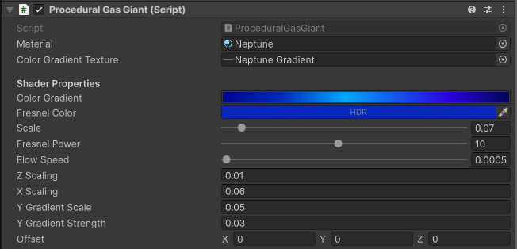
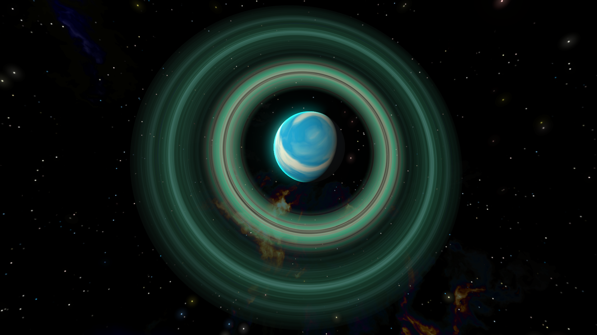

# Procedural Gas Giants

Similar to Procedural Stars, Gas Giants are built with domain warped FBM noise, but the pattern is kept constant around the Y axis, to produce distinct vertical layers.

<video controls loop width="480" height="270">
    <source src="../../assets/videos/jupiter.mp4" type="video/mp4">
    Your browser does not support the video tag.
</video>

## Setup

As with procedural stars, the quickest way to add a new gas giant to your scene is by using the [custom menu commands](custom-menu-commands.md) added to Unity’s context menu. There's options for gas giants with and without asteroid rings.

## MonoBehaviour Component Reference

Similar to the Stars, Gas Giants are built with domain warped FBM noise, but the pattern is kept constant around the Y axis, to produce distinct vertical layers.

You can control the variation along each axis using the X and Z Scaling and Y Gradient Scale and Strength Properties. Observe the difference between the Saturn and Jupiter samples in the Sample Scene.

## Asteroid Rings

Inner and Outer Radius control the shape of the asteroid ring.

The patterns in asteroid rings are built by sampling a detailNoise texture assigned by default to each Procedural Asteroid Shader. As an advanced user, you can plug your own textures here to get different patterns.

## Gas Giant Glow

The glow effect is a full-screen 3D post-processing effect, same as the [Star Corona Glow](./procedural-stars.md/#star-corona-glow-techniques). In addition, it uses the main light direction to darken parts of the effect.

## Advanced Effects

You can use two asteroid rings on the same parent gas giant to get a more varied effect:

/// caption
The ring is composed of two overlapping asteroid ring meshes, with the inner ring's outer radius slightly smaller than the outer ring's inner radius (repeat that 5 times, ha!).
///