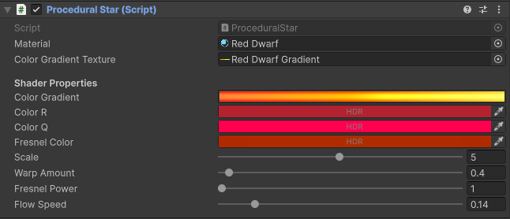
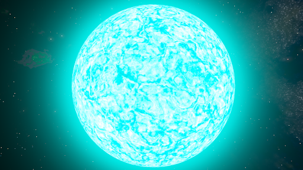
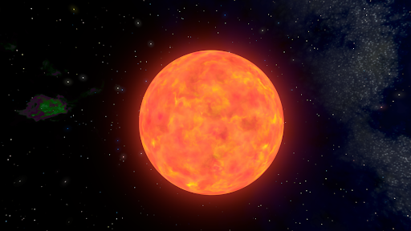
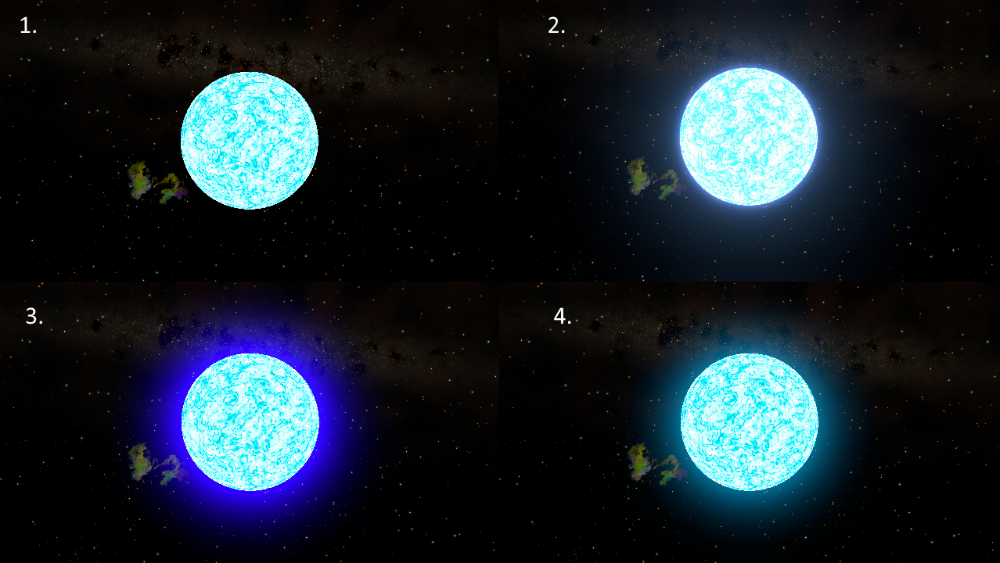
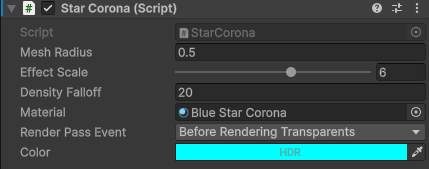

# Procedural Stars

Not to be confused with the procedural [Sun](../shader-skybox/shader-properties-reference.md/#sun) effect in the procedural skybox shader, procedural stars are 3D objects with materials using domain-warped fractal brownian motion noise patterns[^1].

<video controls loop width="480" height="270">
    <source src="../../assets/videos/blue-star.mp4" type="video/mp4">
    Your browser does not support the video tag.
</video>

## Setup

The quickest way to add a new procedural star object to your scene is by using the [custom menu commands](custom-menu-commands.md) added to Unity’s context menu. This will create a body with a mesh and renderer in your scene, coupled with the relevant procedural MonoBehaviours, and create and bind the necessary textures and materials for the procedural shader.

## MonoBehaviour Component Reference

Instead of directly modifying the shader/material properties, it's recommended for you to use a MonoBehaviour Procedural Star component. These update the shader properties, bind the gradient texture sampled in the shader to a user-friendly inspector gradient editor, make sure the effects remain consistent if the object's scale changes. 

### Colors - Domain Warp Sampling

The domain warped noise that forms the basis for the dynamic pattern produces a main noise value that samples the Color Gradient, and two values R and Q, which are used to blend that color with tints. Myriad effects and patterns  can be achieved by adjusting the Color Gradient, R and Q colors. 

The Fresnel Color is an additional emissive effect added at the edges of star spheres. 

### Warping and Scaling

The Warp Amount and Scale properties produce the roiling, twisting pattern of the star's liquid surface.

|  |
|:--:|
| Warp Amount=4 and Scale=4 make for a very high-detail, swirling, liquid blue giant.|

|  |
|:--:|
| The red dwarf with Scale=5 but Warp Amount = 0.4 has much lower frequency detail.|

[^1]: For more information on these techniques, check out Inigo Quilez's [article](https://iquilezles.org/articles/warp/).

## Star Corona Glow Techniques

The glow effect around the star spheres can be achieved in two ways:

- Custom Render Pass Post-Processing Effect
- URP Bloom

/// caption
**Glow Comparisons:** 1. Glow disabled  2. Bloom Glow  3. PostFX Glow  4. PostFX Glow
///

### PostFX Glow

If you want your star glow effect to be fully independent of volumes and lighting, you can implement it through the Star Corona Glow component:

Each star corona is a full-screen 3D post-processing effect applied through a custom ScriptableRenderPass using Unity’s RenderGraph API. You should not have to adjust the Render Pass Event from the default ‘Before Rendering Transparents’ unless you’re running other effects that might interfere with these, like stacking cameras or screen overlays. The default event also supports the sample 3D Skybox implementation with custom render passes.

The Star Object Radius property relates to the radius of the mesh used for the star object. The default value of 0.5 applies to Unity’s Sphere mesh and the custom high-resolution ico-sphere mesh provided with this asset. You do not have to modify this property if you’re changing the star GameObject’s transform scale, the scale is calculated automatically and passed to the shader through the Star Corona MonoBehaviour.

Each object in the scene with this glow component adds an additional render pass to apply the effect.

