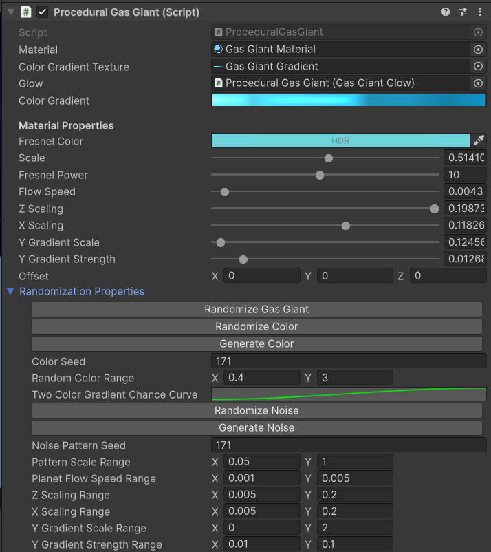

# Random Generation

As an alternative to manually adjusting the properties of the procedural materials, you can use the new randomization buttons to generate random variants instantly:


/// caption
The same functionality has also been added to Stars and Asteroid rings.
///

You can use it in the Editor:

<video controls loop width="960" height="540">
    <source src="../../assets/videos/random-gen.mp4" type="video/mp4">
    Your browser does not support the video tag.
</video>

Or at runtime:

<video controls loop width="960" height="540">
    <source src="../../assets/videos/random-runtime-gen.mp4" type="video/mp4">
    Your browser does not support the video tag.
</video>

The randomization methods that are being called are:
```
ProceduralAsteroidRing>GenerateRandomAsteroidRing()
ProceduralGasGiant>GenerateRandomGasGiant()
ProceduralStar>GenerateRandomStar()
```
There are also additional public methods for generating directly from a seed, that you can link to your own UI.