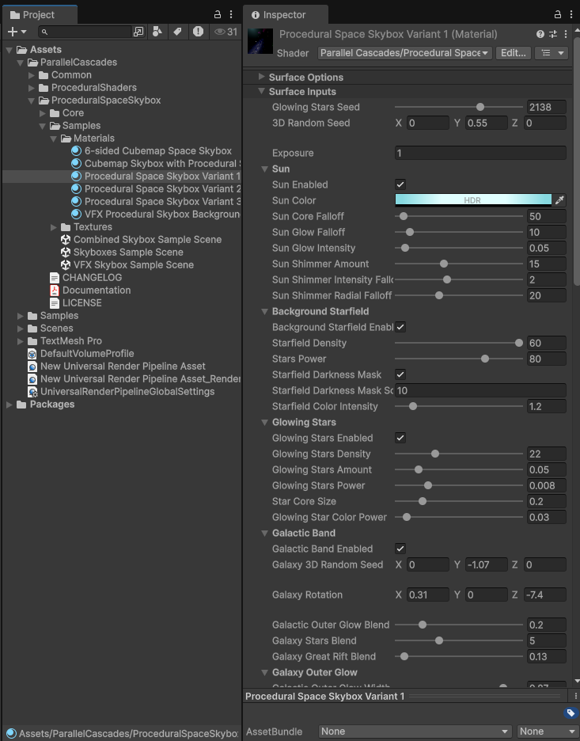
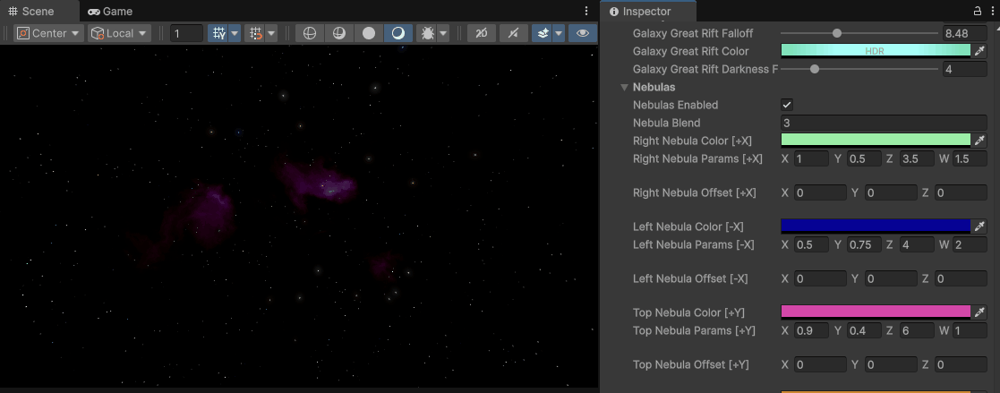

# Customizing the Skybox Shader

## Material Inspector

To customize the skybox, select the material in your project view to open the shader editor window in the inspector.

The shadergraph is modular, with each module contained in a subgraph, and its properties exposed in a separate category in the editor. You can toggle modules on or off and tweak their parameters to create unique skyboxes. For a detailed breakdown of all the shader properties, see the [Shader Properties Reference](shader-properties-reference.md).

## Hiding nebulas

If the nebulas on a certain side of the skybox are overlapping the galactic disk, or you simply want to hide them, you can increase their Falloff property until they disappear.

## Color Palettes

To create more interesting color transitions for the skyboxes, all nebulas and galaxy effects sample their colors from a palette in the way described in Inigo Quilez’s Article: [Color Palettes](https://iquilezles.org/articles/palettes/). This means that the selected color in the inspector might not always correspond to the final color of the skybox - the color is just the offset D applied to the base colors A, B and C which are hidden away inside the shadergraph, and can be edited manually if more control over the palettes is desired. Furthermore, the range of sampled values can be controlled as explained in the [Shader Properties Reference](shader-properties-reference.md). 

See how adjusting this palette color affects the galaxy glow:

