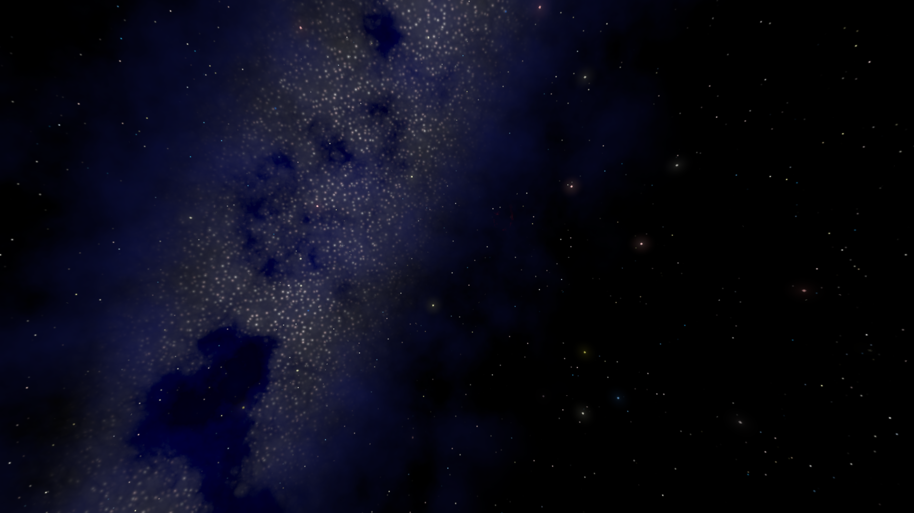
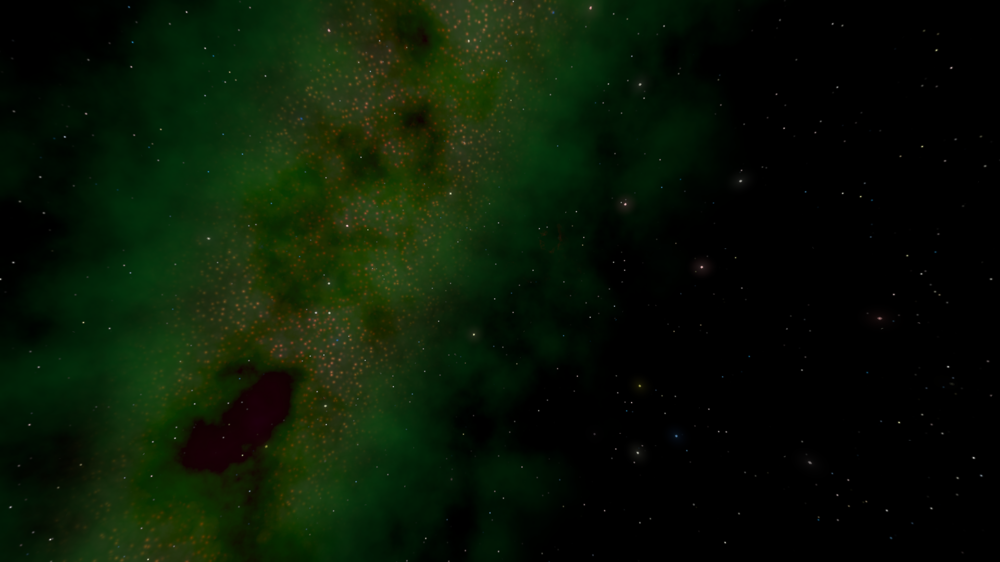
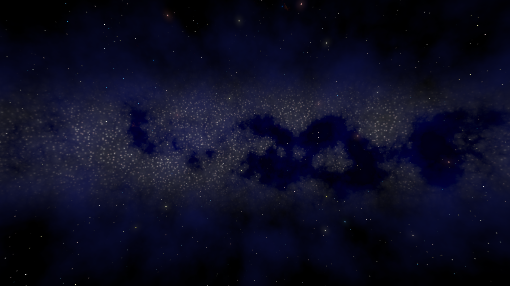
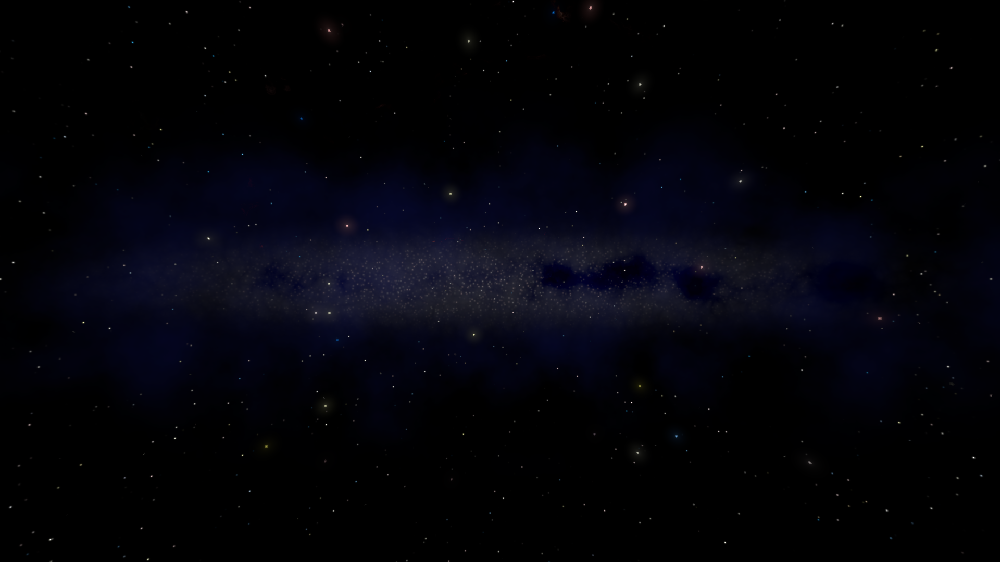
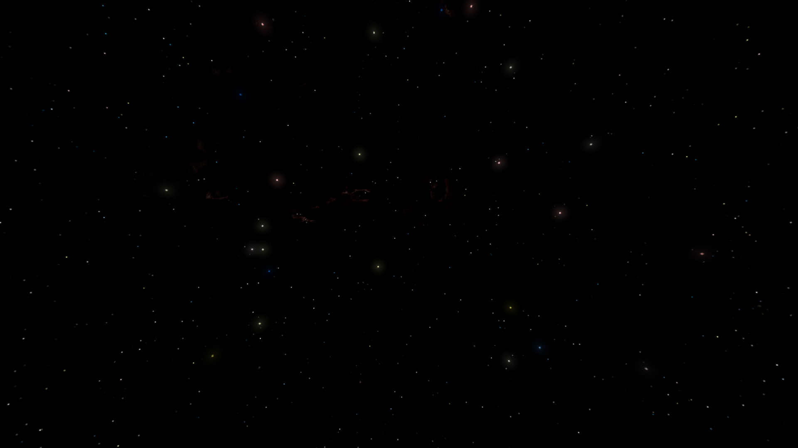
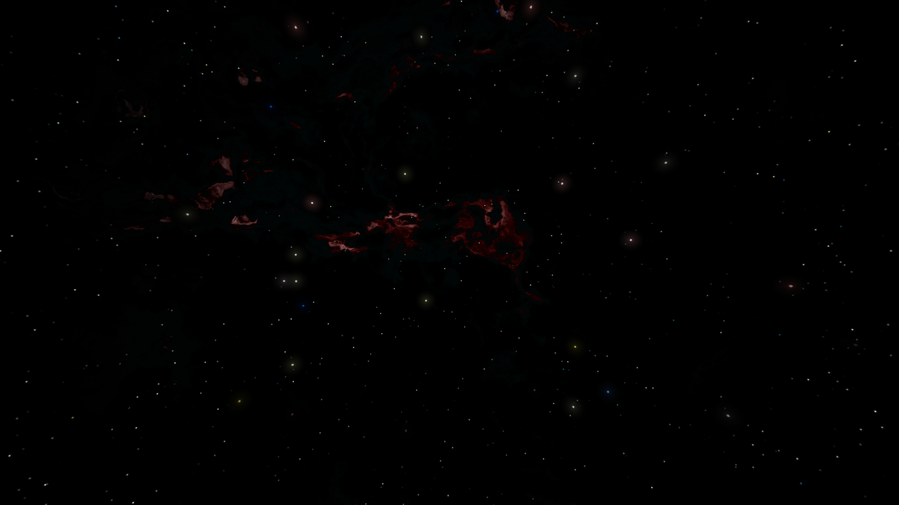
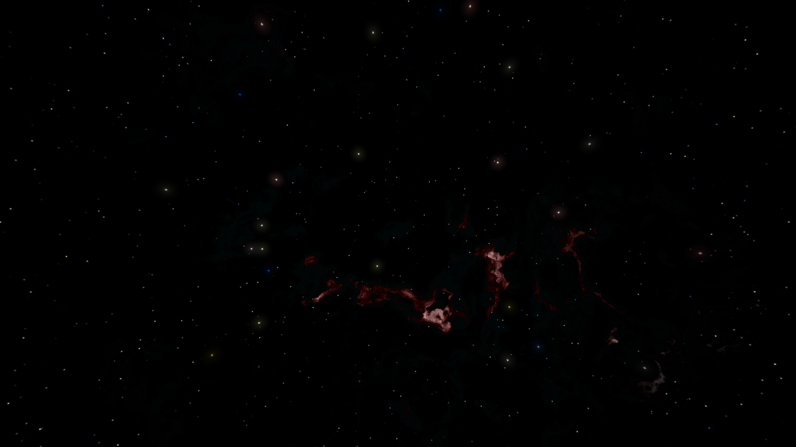

# Shader Skybox Introduction

The procedural skybox shader is versatile but performance heavy skybox solution. It uses various procedural noise techniques to generate natural looking space components - fields of stars, nebula clouds, suns and a galactic band.

Its main benefit is its customisability - all of the skybox components are modular and adjustible, allowing infinite skybox variants. Have a look at some of the sample images below:

|  |
|:--:|
| Example 1: A starfield with small star dots with varied colors and sizes. Fewer, larger, glowing stars can be seen. Dominating the view is a large luminous galactic band, with a far denser star field, and a soft blue glow spreading from its edges.|

|  |
|:--:|
| Example 2: The colors of the galactic band are altered, the starfield now has a faded, red glow, and the blue glow is transformed into a sickly green cloud. |

|  |
|:--:|
| Example 3: Back to the original blue galaxy, it can be rotated to lie on a 'horizontal' plane (of course, there is no horizon in space). |

|  |
|:--:|
| Example 4: The galaxy effect size can be reduced, creating a smaller galactic disk, or one that is further away from the observer. |

|  |
|:--:|
| Example 5: The galactic band effect can be completely disabled, revealing some faint reddish nebulas that were previously obscured. |

|  |
|:--:|
| Example 8: Increasing the glow of the nebulas shows their natural patterns much more clearly. |

|  |
|:--:|
| Example 9: Individual control of the random seed used for the nebula shape noise algorithm allows us to create new nebula shapes.  |
