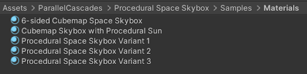
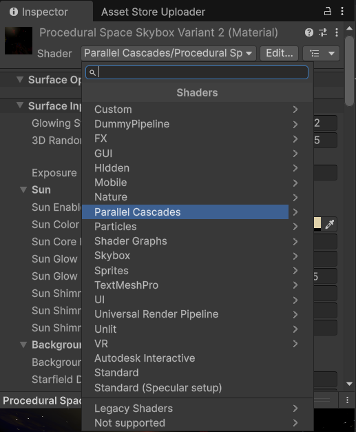
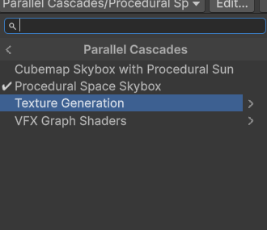
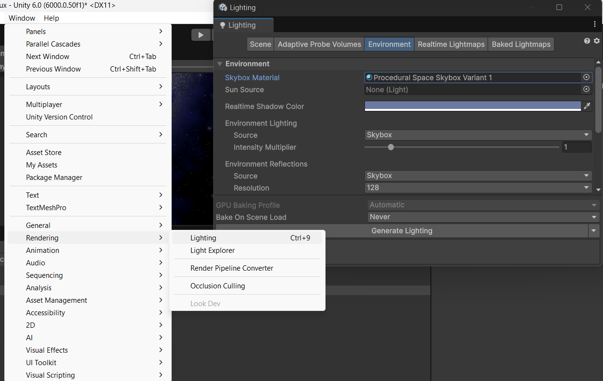

# Shader Skybox Setup

## Sample Skybox Materials
First, you need to have a material using the procedural skybox shader in your project. You can find some preset materials included with this asset in the Samples foler:

## Create your own materials
If you want to create your own materials using the procedural skybox shader, you need to create a new material and assign it the Proecdural Space Skybox shader:

1. In the Inspector, click the **Shader** dropdown on your new material.

    

2. Select **Procedural Space Skybox** from the list.

    

## Applying the skybox material in a scene

To apply a skybox in a scene you can either:

1. Drag and drop the desired skybox material onto the background of the scene view and the skybox should update automatically.

1. Place the material in the scene Skybox Material slot found in the menu `Window>Rendering>Lighting>Environment`

