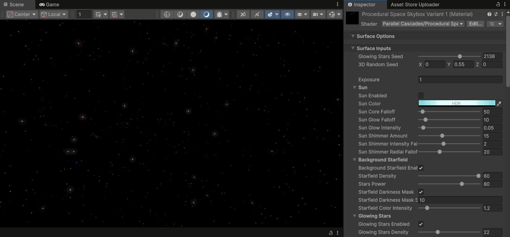

# Properties Reference

## Random Seed

All of the effects of this skybox shader are generated from pseudorandom noise functions. These are seeded with an initial value, out of which each unique variation is generated. There are several properties for random seeds for different effects:

|  |
|:--:|
| The 3D Random seed affects background stars, nebulas and the galaxy band. Notice how the glowing stars remain stationary, as they use a different seed. Also notice how 'scrolling' the 3D seed in any direction makes the effects 'flow'. These noise algorithms are continuous functions, and small changes to the 3D seed shift the pattern in the designated direction. |

The galactic band and nebulas also have their own 3D seed variables, if you only want to alter those effects.

|  |
|:--:|
| For nebulas, the property is named Nebula Offset, and there are 6 such properties, one for each side of the skybox cube. In the example Back Nebula Offset[-Z] is the nebula generated towards the -Z direction in 3D space. |

Glowing stars have their own integer seed, as they are generated in a different manner:

|  |
|:--:|
| Notice how the function here is not continuous, so every new seed generates a totaly different star placement. |

## Global Properties

1. **Glowing Stars Seed**: Random seed value for glowing stars distribution.
2. **3D Random Seed**: Random seed value affecting background stars distribution, nebulas, and galactic disk shapes.
3. **Exposure**: Affects the overall brightness of the shader.

## Sun

1. **Sun Enabled**: Boolean keyword toggles the effect on or off, improving performance if the effect is not needed.
2. **Sun Color**: Color of the sun glow. HDR color makes the emitted light bright and realistic.
3. **Sun Core Falloff**: Controls the size of the sun sphere in the center.
4. **Sun Glow Falloff**: Controls the size of the sun glow, the dimmer light surrounding the core. Should be less than the Sun Core Falloff for it to be visible.
5. **Sun Glow Intensity**: Brightness of the Sun Glow Effect.
6. **Sun Shimmer Amount**: Amount of light rays extending from the sun core.
7. **Sun Shimmer Intensity Falloff**: Brightness of the light rays.
8. **Sun Shimmer Radial Falloff**: How far the light rays extend out of the sun core.

## Background Starfield

1. **Background Starfield Enabled**: Boolean keyword toggles the effect on or off, improving performance if the effect is not needed.
2. **Starfield Density**: Controls the size and density of stars.
3. **Stars Power**: Increasing this value makes star dots larger and brighter.
4. **Starfield Darkness Mask**: Noise pattern applied over the stars to create a more natural-looking star distribution with regions of darkness between stars. Can be toggled on or off.
5. **Starfield Darkness Mask Scale**: Controls the scale of the darkness noise.
6. **Starfield Color Intensity**: Makes star dots brighter and more saturated.

## Glowing Stars

1. **Glowing Stars Enabled**: Boolean keyword toggles the effect on or off, improving performance if the effect is not needed.
2. **Glowing Stars Density**: Controls the size and density of glowing stars.
3. **Glowing Stars Amount**: Further controls star density without affecting size.
4. **Glowing Stars Power**: Increasing this value makes glowing stars larger and brighter.
5. **Star Core Size**: Controls the size of the glowing star core dot, separately from its spherical glow.
6. **Glowing Star Color Power**: Makes glowing stars brighter and more saturated.

## Galactic Band

1. **Galactic Band Enabled**: Boolean keyword toggles the effect on or off, improving performance if the effect is not needed.
2. **Galaxy 3D Random Seed**: Random seed value only affecting the galaxy’s shape. This value and 3D Random Seed are added together to produce the final seed for the galaxy.
3. **Galaxy Rotation**: Euler Rotation for galactic disk in radians.
4. **Galactic Outer Glow Blend**: Controls how visible the outer glow part of the galactic band is.
5. **Galaxy Stars Blend**: Controls how visible the galaxy stars are.
6. **Galaxy Great Rift Blend**: Controls how visible the Great Rift is.
7. **Galaxy Outer Glow**: The background light component of the galactic band.
8. **Galaxy Disk**: The central region of the galactic band, filled with stars (star properties are controlled in a separate category).
9. **Galaxy Great Rift**: A cloudy region of gas that obscures parts of the galactic disk.
10. **Width and Height**: Control the shape of the effect (repeated for modules).
11. **Noise Scale**: Controls the scale of the noise used for the shape of the effect (repeated for modules).
12. **Falloff**: Controls how sharply the effect recedes into the background (repeated for modules).
13. **Color**: Used for the offset in the cosine palette sampling described in the Customizing the Skybox section (repeated for modules).
14. **Color Range**: Upper and lower bound of the area of the palette that is sampled to produce the final color. Not present in Great Rift.
15. **Galaxy Great Rift Darkness Factor**: Controls how strongly the Great Rift hides the galactic stars behind it. Only affects stars inside the galactic disk.
16. **Galaxy Stars**: The dense field of stars inside the galactic disk.
17. **Galaxy Stars Power**: Increasing this value makes star dots larger and brighter.
18. **Galaxy Star Mask Falloff**: Controls how sharply the stars recede into the background galaxy.
19. **Galaxy Stars Density**: Controls the size and density of stars inside the Galactic Disk.
20. **Galaxy Stars Color Intensity**: Makes star dots inside the galactic disk brighter and more saturated.

## Nebulas

1. **Nebulas Enabled**: Boolean keyword toggles the effect on or off, improving performance if the effect is not needed.
2. **Nebula Blend**: Controls visibility of all nebulas.
3. **Nebula Color**: Color sampling offset as explained in the Customizing the Skybox section.
4. **Nebula Params (Parameters)**:
    - **X: Scale**: Noise scale property, best kept between 0 and 1 for domain warped noise.
    - **Y: Domain Warp**: Strength of domain warping effect, 0 creates simple cloudy looking nebulas, 1 creates very warped ‘islands’ of nebulas.
    - **Z: Falloff**: How sharply nebulas recede into the cosmic background. Increase to hide nebulas on a certain side.
    - **W: Color Gradient Upper Length**: The upper bound of the color range sampling effect, increasing this value introduces more layers of color into nebulas.
5. **Nebula Offset**: Random seed value only affecting the nebula on that side’s shape. This value and 3D Random Seed are added together to produce the final seed for the nebula.
