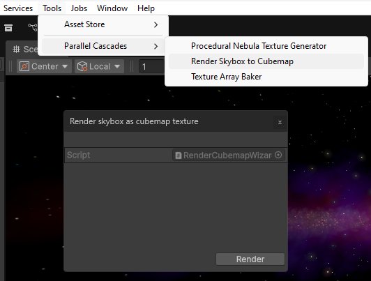

# Improving Shader Skybox Performacnce

## Dynamic Skybox Shader Runtime Performance

Using the skybox shader with all modules enabled can have a heavy impact on performance. The procedural noise functions using fractal sums (multiple layers of noise) that are used to generate natural looking nebulas and galactic band patterns are the most performance intensive. The nebulas sub-graph module uses a variant of this called Domain Warping which taxes the GPU the most out of all functions.

While this is not a problem when adjusting the skybox in the Editor, at runtime it can make your game run very slowly.

The following performance has been measured at runtime on an NVIDIA GTX 3060 GPU, constant across Playmode in the Editor and Windows Builds:

- 82 FPS average at 1080p

- 25 FPS average at 2160p

There are two methods to greatly improve performance: Using the [Render Cubemap Wizard](#render-cubemap-wizard) to bake a dynamic skybox into a static cubemap texture, or using the [VFX Graph Skybox](../vfx-graph-skybox/setup.md) for nebula rendering.

## Render Cubemap Wizard

For the best performance, once a skybox has been generated, it can be captured and rendered into a static cubemap using an editor utility included with this package - this completely frees up the GPU, barely has any impact on performance, as we're just sampling a texture. 

The downside to this is that a high quality skybox cubemap texture can take up a lot of disk space ~ 400 MB for a 6-sided skybox texture where each face of the skybox is 4096x4096 resolution. You can think of this process as transferring the load from your GPU to your drive.

When you click the `Render` button, whatever skybox is currently in the scene will be captured and baked into a single high-quality 4K PNG texture. 

You should note that whatever 3D objects are in the scene will also get captured, as the cubemap baking process basically instantiates a temporary camera at the scene center, and uses it to capture a 360 view of the entire skybox. If you don't want this to happen, disable any scene objects before rendering the skybox.

If your skybox has the Procedural Sun module enabled, it will get statically captured in the cubemap texture, which might not be what you want. The Sun effect itself is not performance heavy, so the static skybox shader that is shipped with this package also includes this effect, in case you want to have a procedural sun moving with main light direction.

Once you have rendered your cubemap texture, you can use it in your scene by creating a new material with the `Parallel Cascades/Cubemap Skybox with Procedural Sun` shader, or using the sample material with the same name in the `ProceduralSpaceSkybox/Samples/Materials` folder and assigning it a new texture.