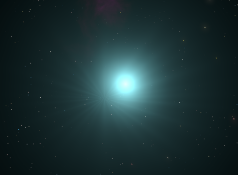
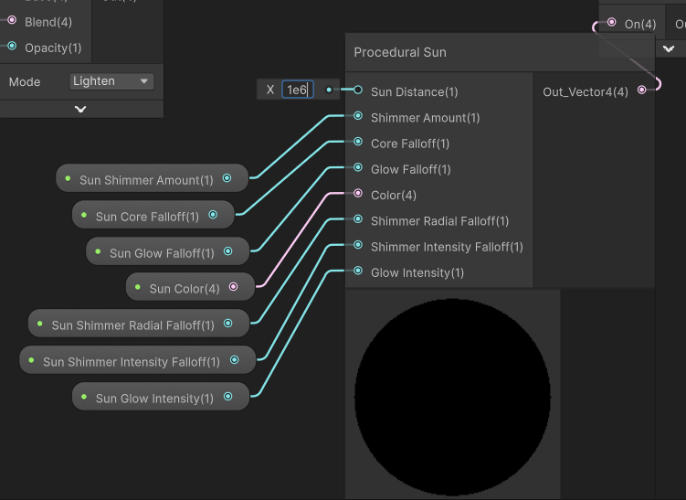

# Troubleshooting

## Sun Shimmer moving with camera

This might happen if your game camera is moving very large distances, due to the way the shimmer effect is calculated requiring a fixed value for the distance to the sun object (note that the default distance is 10^7 so this shouldn't occur under regular circumstances).

To fix this, you can increase the Sun Distance property in the Procedural Sun module.

