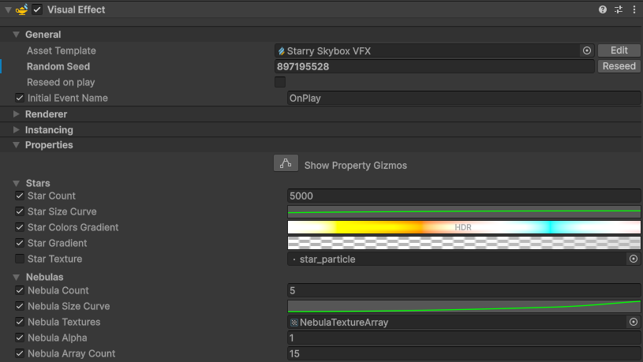

# VFX Graph Skybox Customization

You can generate new variants of the same effect, randomising star and nebula placements, colors and sizes by *Reseeding* the component. The asset comes with a set of 15 pre-generated nebula textures, randomly picked from for every iteration. You can choose your own textures for stars, as well as their colors and sizes. You can also create your own nebula textures with the [Procedural Nebula Texture Generator](procedural-nebula-texture-generator.md) and Texture Array Baker editor tools.