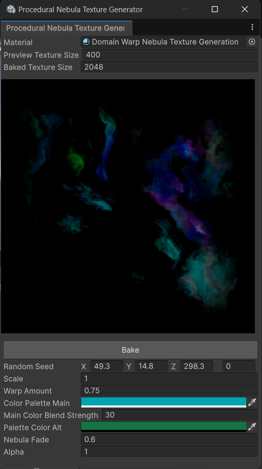
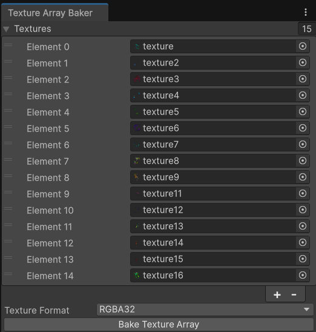

# Procedural Nebula Texture Generator

You can find this custom Editor Window under Tools/Parallel Cascades/Procedural Nebula Texture Generator. You can use it to preview and generate procedural nebulas, which you can then use in the VFX Skybox: 

You can modify the material properties from this window, and any changes will be immediately reflected in the preview image. Scrolling through the random seed in the manner explained in the [Skybox Shader Property Reference](../shader-skybox/shader-properties-reference.md/#random-seed) allows you to generate new nebula shapes.

Once you are happy with the result click `Bake` and save the texture in your project.

## Texture Array Baker

The skybox visual effect expects all nebula textures it uses to be packed into a TextureArray, which needs to be done through another editor tool:

<figure markdown="span">
    
    <figcaption>This window is found under <code>Tools/Parallel Cascades/Texture Array Baker</code></figcaption>
</figure>

You can assign the texture you want to bake through the inspector interface or multiple select and drag and drop them directly onto the `Textures` field.

You need to be wary of texture sizes when baking large texture arrays here, as the 15 texture nebula array in the Samples of this asset is 480 MB in size.