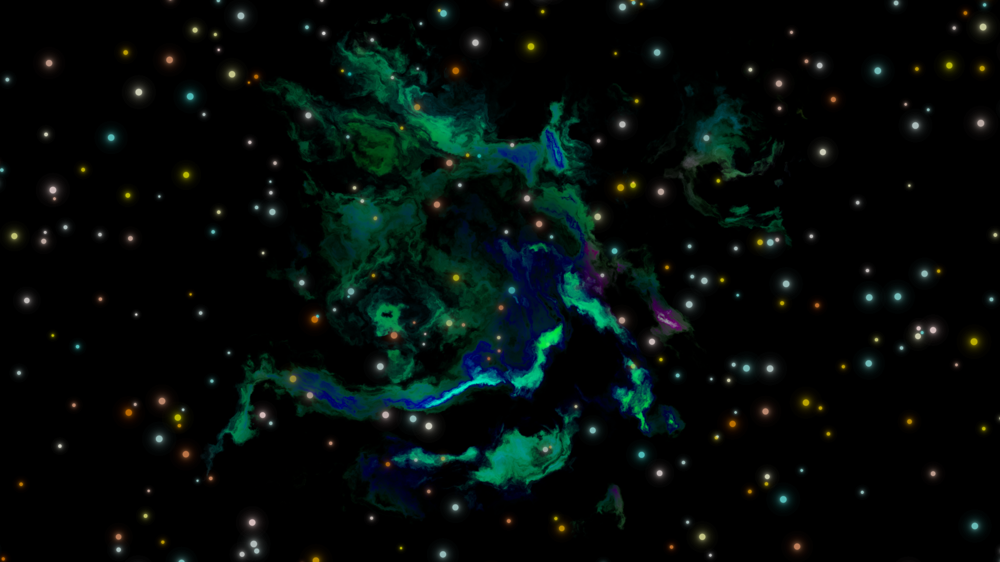
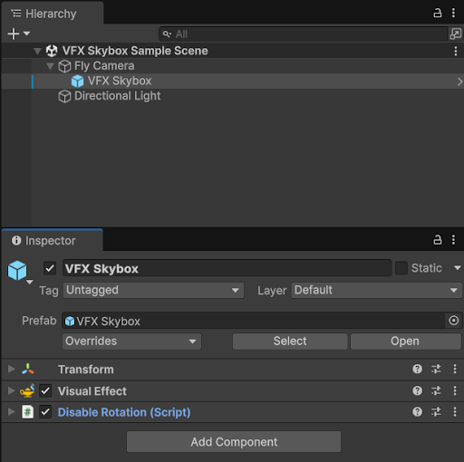
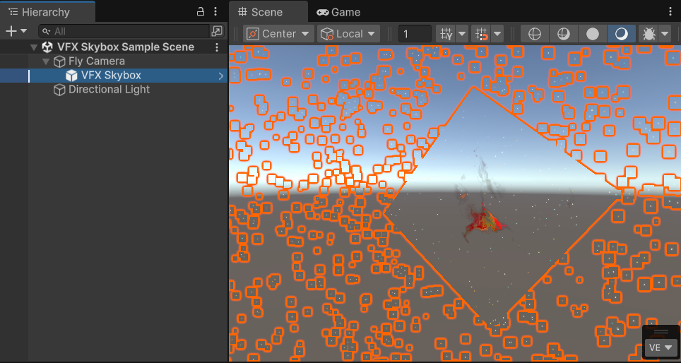
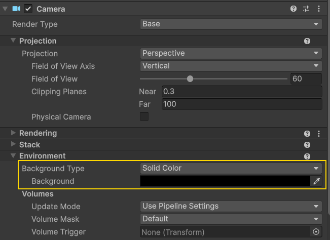
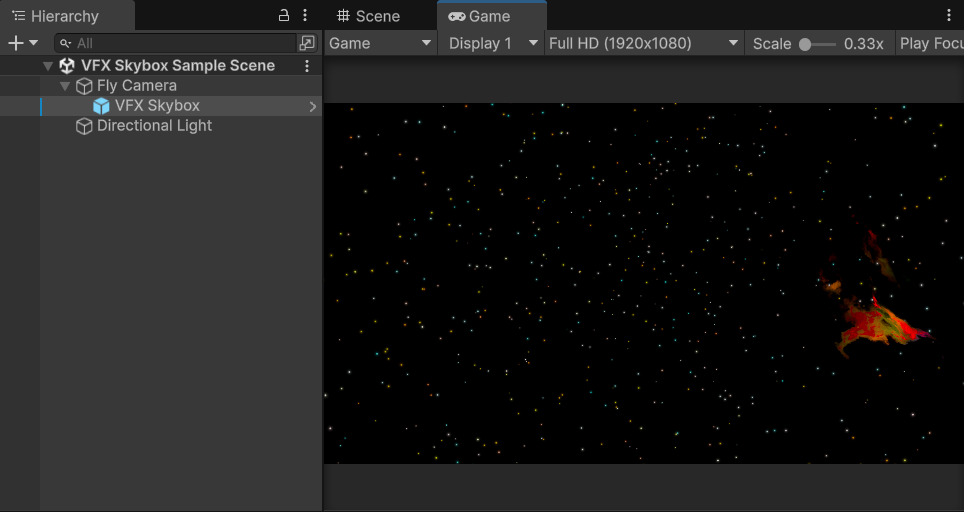

# VFX Graph Skybox

The VFX Graph Skybox is not a traditional skybox - it is a visual effect that uses some tricks to appear as if it is a static skybox, drawn behind all other objects.

## Applying the skybox

To add the skybox to your scene, drag the VFX Skybox prefab from ProceduralSpaceSkybox/Core/VFX into your scene, and make it a child of your main camera. This ensures the effect moves with the camera and always appears infinitely far away.

The `Disable Rotation` script handles keeping the orientation of the skybox static regardless of the actual camera rotation, so that you can look around the skybox.

Once dropped in the scene, the visual effect will automatically load, and will be displayed in the game and scene views.

The default skybox material is still being drawn behind this. In order to disable this in the game view, you should find your main camera’s Camera component, and under the Environment Tab, set Background Type to Solid Color and choose whatever color you want for your skybox background:

This will be reflected in your Game View (but not in the Scene View!):

## Combining the VFX Skybox with a Procedural Shader Skybox

A solid black background is functional for the VFX Skybox, but an improved effect can be achieved by adding the procedural skybox shader as a background. You can toggle the modules you don't want off - so you could have the procedural Sun and Galactic band, whilst leaving the stars and nebulas to the more performant VFX Skybox.
